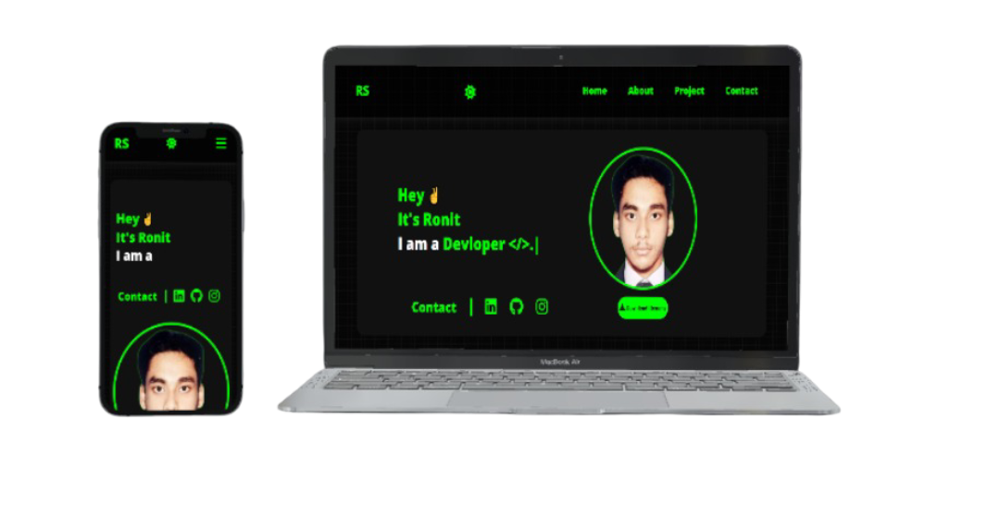

<h2 align="center">
  Portfolio Website - v2.0 
  <a href="https://ronitshakhari.netlify.app/" target="_blank">Ronit.tech</a>
</h2>

  

 

 &nbsp;
 &nbsp;
 &nbsp;
 &nbsp;

## Built With

My personal portfolio <a href="https://ronitshakhari.netlify.app/" target="_blank">Ronit.tech</a> which features some of my github projects as well as my resume and technical skills. 

This project was built using these technologies.

- HTML5
- JavaScript
- CSS3
- VsCode
- Netlify

## Features

**📖 Multi-Page Layout**

**🎨 Styled with Css easy to customize colors**

**📱 Fully Responsive**

## Usage Instructions

Open the project folder and Navigate to `/src`.  
You will find all the Language used .

### Show your support

Give a ⭐ if you like this website!
